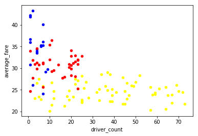
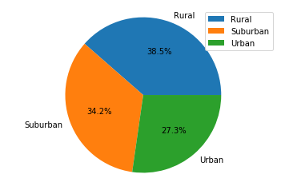
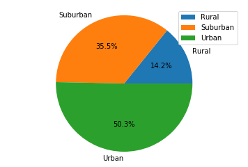
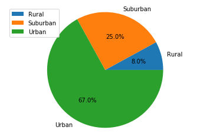

```python
import pandas as pd
import numpy as np
import matplotlib.pylab as plt

```


```python
file1 = 'raw_data/city_data.csv'
file2 = 'raw_data/ride_data.csv'
```


```python
city_df = pd.read_csv(file1)
ride_df = pd.read_csv(file2)
```


```python
city_df=city_df.sort_values('city')
city_df.head(10)
city_df = city_df.reset_index()
```


```python
ride_df.head(10)
```


<div>
<style scoped>
    .dataframe tbody tr th:only-of-type {
        vertical-align: middle;
    }

    .dataframe tbody tr th {
        vertical-align: top;
    }

    .dataframe thead th {
        text-align: right;
    }
</style>
<table border="1" class="dataframe">
  <thead>
    <tr style="text-align: right;">
      <th></th>
      <th>city</th>
      <th>date</th>
      <th>fare</th>
      <th>ride_id</th>
    </tr>
  </thead>
  <tbody>
    <tr>
      <th>0</th>
      <td>Lake Jonathanshire</td>
      <td>2018-01-14 10:14:22</td>
      <td>13.83</td>
      <td>5739410935873</td>
    </tr>
    <tr>
      <th>1</th>
      <td>South Michelleport</td>
      <td>2018-03-04 18:24:09</td>
      <td>30.24</td>
      <td>2343912425577</td>
    </tr>
    <tr>
      <th>2</th>
      <td>Port Samanthamouth</td>
      <td>2018-02-24 04:29:00</td>
      <td>33.44</td>
      <td>2005065760003</td>
    </tr>
    <tr>
      <th>3</th>
      <td>Rodneyfort</td>
      <td>2018-02-10 23:22:03</td>
      <td>23.44</td>
      <td>5149245426178</td>
    </tr>
    <tr>
      <th>4</th>
      <td>South Jack</td>
      <td>2018-03-06 04:28:35</td>
      <td>34.58</td>
      <td>3908451377344</td>
    </tr>
    <tr>
      <th>5</th>
      <td>South Latoya</td>
      <td>2018-03-11 12:26:48</td>
      <td>9.52</td>
      <td>1994999424437</td>
    </tr>
    <tr>
      <th>6</th>
      <td>New Paulville</td>
      <td>2018-02-27 11:17:56</td>
      <td>43.25</td>
      <td>793208410091</td>
    </tr>
    <tr>
      <th>7</th>
      <td>Simpsonburgh</td>
      <td>2018-04-26 00:43:24</td>
      <td>35.98</td>
      <td>111953927754</td>
    </tr>
    <tr>
      <th>8</th>
      <td>South Karenland</td>
      <td>2018-01-08 03:28:48</td>
      <td>35.09</td>
      <td>7995623208694</td>
    </tr>
    <tr>
      <th>9</th>
      <td>North Jasmine</td>
      <td>2018-03-09 06:26:29</td>
      <td>42.81</td>
      <td>5327642267789</td>
    </tr>
  </tbody>
</table>
</div>


```python
city_df['average_fare'] = ride_df.groupby('city')['fare'].mean().to_frame().reset_index()['fare']
```


```python
city_df['total_rides']=ride_df['city'].value_counts().to_frame().reset_index().sort_values('index').reset_index()['city']

```


```python
driver_count_per = city_df.groupby('city')['driver_count'].sum().to_frame().reset_index()
```


```python
city_type = city_df.groupby('city')['type'].sum().to_frame().reset_index()
```


```python
city_df.head()

```


<div>
<style scoped>
    .dataframe tbody tr th:only-of-type {
        vertical-align: middle;
    }

    .dataframe tbody tr th {
        vertical-align: top;
    }

    .dataframe thead th {
        text-align: right;
    }
</style>
<table border="1" class="dataframe">
  <thead>
    <tr style="text-align: right;">
      <th></th>
      <th>index</th>
      <th>city</th>
      <th>driver_count</th>
      <th>type</th>
      <th>average_fare</th>
      <th>total_rides</th>
    </tr>
  </thead>
  <tbody>
    <tr>
      <th>0</th>
      <td>61</td>
      <td>Amandaburgh</td>
      <td>12</td>
      <td>Urban</td>
      <td>24.641667</td>
      <td>18</td>
    </tr>
    <tr>
      <th>1</th>
      <td>9</td>
      <td>Barajasview</td>
      <td>26</td>
      <td>Urban</td>
      <td>25.332273</td>
      <td>22</td>
    </tr>
    <tr>
      <th>2</th>
      <td>90</td>
      <td>Barronchester</td>
      <td>11</td>
      <td>Suburban</td>
      <td>36.422500</td>
      <td>16</td>
    </tr>
    <tr>
      <th>3</th>
      <td>88</td>
      <td>Bethanyland</td>
      <td>22</td>
      <td>Suburban</td>
      <td>32.956111</td>
      <td>18</td>
    </tr>
    <tr>
      <th>4</th>
      <td>115</td>
      <td>Bradshawfurt</td>
      <td>7</td>
      <td>Rural</td>
      <td>40.064000</td>
      <td>10</td>
    </tr>
  </tbody>
</table>
</div>


```python
urban_type = city_df.loc[city_df.type == 'Urban']
suburban_type = city_df.loc[city_df.type == 'Suburban']
rural_type = city_df.loc[city_df.type == 'Rural']
```


```python
suburban_type.head()
```


<div>
<style scoped>
    .dataframe tbody tr th:only-of-type {
        vertical-align: middle;
    }

    .dataframe tbody tr th {
        vertical-align: top;
    }

    .dataframe thead th {
        text-align: right;
    }
</style>
<table border="1" class="dataframe">
  <thead>
    <tr style="text-align: right;">
      <th></th>
      <th>index</th>
      <th>city</th>
      <th>driver_count</th>
      <th>type</th>
      <th>average_fare</th>
      <th>total_rides</th>
    </tr>
  </thead>
  <tbody>
    <tr>
      <th>2</th>
      <td>90</td>
      <td>Barronchester</td>
      <td>11</td>
      <td>Suburban</td>
      <td>36.422500</td>
      <td>16</td>
    </tr>
    <tr>
      <th>3</th>
      <td>88</td>
      <td>Bethanyland</td>
      <td>22</td>
      <td>Suburban</td>
      <td>32.956111</td>
      <td>18</td>
    </tr>
    <tr>
      <th>5</th>
      <td>91</td>
      <td>Brandonfort</td>
      <td>10</td>
      <td>Suburban</td>
      <td>35.437368</td>
      <td>19</td>
    </tr>
    <tr>
      <th>8</th>
      <td>69</td>
      <td>Colemanland</td>
      <td>23</td>
      <td>Suburban</td>
      <td>30.894545</td>
      <td>22</td>
    </tr>
    <tr>
      <th>9</th>
      <td>97</td>
      <td>Davidfurt</td>
      <td>23</td>
      <td>Suburban</td>
      <td>31.995882</td>
      <td>17</td>
    </tr>
  </tbody>
</table>
</div>


```python
ax = urban_type.plot(kind='scatter', x = 'driver_count',y='average_fare',c=(1,1,0))
rural_type.plot(kind='scatter', x = 'driver_count',y='average_fare',c=(0,0,1), ax=ax)
suburban_type.plot(kind='scatter', x = 'driver_count',y='average_fare',c=(1,0,0), ax=ax)
#(Gold, Light Sky Blue, and Light Coral)
```


    <matplotlib.axes._subplots.AxesSubplot at 0x1f48ad78748>




#* % of Total Fares by City Type
type_keys = city_df.groupby(['type'])['average_fare'].mean().keys()
type_percents = city_df.groupby(['type'])['average_fare'].mean().tolist()

```python
plt.pie(type_percents, labels = type_keys, autopct ='%1.1f%%')
plt.legend(type_keys, loc="best")
plt.axis('equal')
plt.show()
```





```python
#* % of Total Rides by City Type
total_ride_keys = city_df.groupby(['type'])['total_rides'].mean().keys()
total_ride_percents = city_df.groupby(['type'])['total_rides'].mean().tolist()
```


```python
plt.pie(total_ride_percents, labels = total_ride_keys, autopct ='%1.1f%%')
plt.legend(type_keys, loc="best")
plt.axis('equal')
plt.show()
```





```python
#* % of Total Drivers by City Type
total_driver_keys = city_df.groupby(['type'])['driver_count'].mean().keys()
total_driver_percents = city_df.groupby(['type'])['driver_count'].mean().tolist()
```


```python
plt.pie(total_driver_percents, labels = total_driver_keys, autopct ='%1.1f%%')
plt.legend(type_keys, loc="best")
plt.axis('equal')
plt.show()
```




