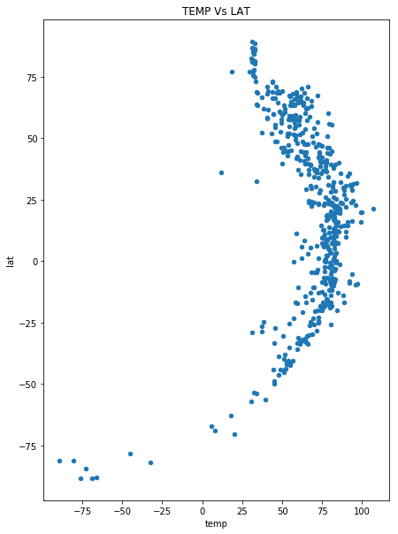
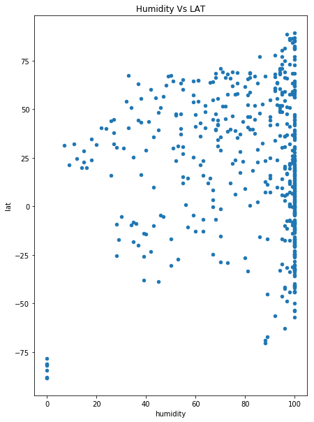
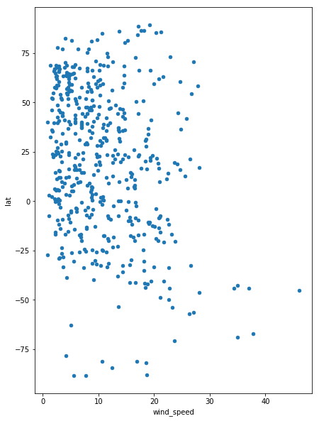

#* You must include a written description of three observable trends based on the data.

1. The temperature of a city is hotter the closer it is to 0 latitude.

2. The humidity of a city is not determined by it's latitude.

3. The wind speed does not seem to be affected by the latitude.


```python


# Dependencies and Setup
import matplotlib.pyplot as plt
import pandas as pd
import numpy as np
import requests
import time
from tqdm import tqdm

tqdm.pandas()

# Import API key
from api import api_key

# Incorporated citipy to determine city based on latitude and longitude
from citipy import citipy

# Output File (CSV)
output_data_file = "output_data/cities.csv"

# Range of latitudes and longitudes
lat_range = (-90, 90)
long_range = (-180, 180)

```


```python
# List for holding lat_lngs and cities
from collections import defaultdict

lat_lng = defaultdict()
cities = []

# Create a set of random lat and lng combinations
lats = np.random.uniform(low=-90.000, high=90.000, size=1500)
lngs = np.random.uniform(low=-180.000, high=180.000, size=1500)
lat_lngs = zip(lats, lngs)

# Identify nearest city for each lat, lng combination
for x in lat_lngs:
    lat, long = x
    city = citipy.nearest_city(lat,long).city_name
    lat_lng[city] = (lat, long)

```


```python
df = pd.DataFrame(list(lat_lng.items()))
df.columns = ['city','lat_long']
df['lat'] = df.lat_long.map(lambda x: str(x[0]))
df['long'] = df.lat_long.map(lambda x: str(x[1]))
```


```python
def get_current_weather(df_object):
    base_url = "http://api.openweathermap.org/data/2.5/weather"
    params = {
        'APPID' : api_key,
        'lat' : df_object.lat,
        'lon' : df_object.long,
        'units' : 'Imperial'
    }
    data = requests.get(base_url, params=params)
    time.sleep(.50)
    return data.json()
    


#api.openweathermap.org/data/2.5/weather?q={city name}

#* Temperature (F) vs. Latitude
#* Humidity (%) vs. Latitude
#* Cloudiness (%) vs. Latitude
#* Wind Speed (mph) vs. Latitude

```


```python
sample = df.sample(n=500)

sample['weather_json'] = sample.progress_apply(get_current_weather, axis=1)
sample['temp'] = sample.weather_json.map(lambda x: x.get('main').get('temp'))
sample['humidity'] = sample.weather_json.map(lambda x: x.get('main').get('humidity'))
sample['cloudiness'] = sample.weather_json.map(lambda x: x.get('clouds').get('all'))
sample['wind_speed'] = sample.weather_json.map(lambda x: x.get('wind').get('speed'))
sample
```

    100%|██████████| 500/500 [09:58<00:00,  1.19s/it]
    


<div>
<style scoped>
    .dataframe tbody tr th:only-of-type {
        vertical-align: middle;
    }

    .dataframe tbody tr th {
        vertical-align: top;
    }

    .dataframe thead th {
        text-align: right;
    }
</style>
<table border="1" class="dataframe">
  <thead>
    <tr style="text-align: right;">
      <th></th>
      <th>city</th>
      <th>lat_long</th>
      <th>lat</th>
      <th>long</th>
      <th>weather_json</th>
      <th>temp</th>
      <th>humidity</th>
      <th>cloudiness</th>
      <th>wind_speed</th>
    </tr>
  </thead>
  <tbody>
    <tr>
      <th>34</th>
      <td>saskylakh</td>
      <td>(82.32989187054758, 117.79729341104735)</td>
      <td>82.32989187054758</td>
      <td>117.79729341104735</td>
      <td>{'coord': {'lon': 117.8, 'lat': 82.33}, 'weath...</td>
      <td>30.88</td>
      <td>100</td>
      <td>80</td>
      <td>4.03</td>
    </tr>
    <tr>
      <th>549</th>
      <td>maralal</td>
      <td>(1.0617559733105821, 36.95090616039451)</td>
      <td>1.0617559733105821</td>
      <td>36.95090616039451</td>
      <td>{'coord': {'lon': 36.95, 'lat': 1.06}, 'weathe...</td>
      <td>62.02</td>
      <td>98</td>
      <td>92</td>
      <td>2.13</td>
    </tr>
    <tr>
      <th>200</th>
      <td>predivinsk</td>
      <td>(57.094039041442215, 93.74225489732879)</td>
      <td>57.094039041442215</td>
      <td>93.74225489732879</td>
      <td>{'coord': {'lon': 93.74, 'lat': 57.09}, 'weath...</td>
      <td>65.71</td>
      <td>59</td>
      <td>0</td>
      <td>4.36</td>
    </tr>
    <tr>
      <th>313</th>
      <td>vangaindrano</td>
      <td>(-25.083217210338205, 50.61126160676491)</td>
      <td>-25.083217210338205</td>
      <td>50.61126160676491</td>
      <td>{'coord': {'lon': 50.61, 'lat': -25.08}, 'weat...</td>
      <td>72.91</td>
      <td>100</td>
      <td>44</td>
      <td>10.85</td>
    </tr>
    <tr>
      <th>17</th>
      <td>tasiilaq</td>
      <td>(77.14757617009116, -33.380007964529284)</td>
      <td>77.14757617009116</td>
      <td>-33.380007964529284</td>
      <td>{'coord': {'lon': -33.38, 'lat': 77.15}, 'weat...</td>
      <td>18.64</td>
      <td>86</td>
      <td>0</td>
      <td>8.28</td>
    </tr>
    <tr>
      <th>432</th>
      <td>saint-joseph</td>
      <td>(-30.196584983508515, 56.367142130379676)</td>
      <td>-30.196584983508515</td>
      <td>56.367142130379676</td>
      <td>{'coord': {'lon': 56.37, 'lat': -30.2}, 'weath...</td>
      <td>66.61</td>
      <td>100</td>
      <td>68</td>
      <td>9.40</td>
    </tr>
    <tr>
      <th>229</th>
      <td>nabire</td>
      <td>(-3.45129019752072, 133.78252337367468)</td>
      <td>-3.45129019752072</td>
      <td>133.78252337367468</td>
      <td>{'coord': {'lon': 133.78, 'lat': -3.45}, 'weat...</td>
      <td>72.01</td>
      <td>100</td>
      <td>24</td>
      <td>5.93</td>
    </tr>
    <tr>
      <th>446</th>
      <td>keti bandar</td>
      <td>(21.37694357083471, 64.95058761266577)</td>
      <td>21.37694357083471</td>
      <td>64.95058761266577</td>
      <td>{'coord': {'lon': 64.95, 'lat': 21.38}, 'weath...</td>
      <td>84.07</td>
      <td>98</td>
      <td>8</td>
      <td>26.51</td>
    </tr>
    <tr>
      <th>584</th>
      <td>funadhoo</td>
      <td>(6.475563853384074, 74.58434596737064)</td>
      <td>6.475563853384074</td>
      <td>74.58434596737064</td>
      <td>{'coord': {'lon': 74.58, 'lat': 6.48}, 'weathe...</td>
      <td>82.81</td>
      <td>99</td>
      <td>24</td>
      <td>16.55</td>
    </tr>
    <tr>
      <th>321</th>
      <td>katangli</td>
      <td>(51.981653865775314, 144.6812597554092)</td>
      <td>51.981653865775314</td>
      <td>144.6812597554092</td>
      <td>{'coord': {'lon': 144.68, 'lat': 51.98}, 'weat...</td>
      <td>43.30</td>
      <td>94</td>
      <td>20</td>
      <td>7.72</td>
    </tr>
    <tr>
      <th>439</th>
      <td>kawalu</td>
      <td>(-13.750682819196342, 107.31964342552425)</td>
      <td>-13.750682819196342</td>
      <td>107.31964342552425</td>
      <td>{'coord': {'lon': 107.32, 'lat': -13.75}, 'wea...</td>
      <td>76.51</td>
      <td>100</td>
      <td>92</td>
      <td>20.80</td>
    </tr>
    <tr>
      <th>566</th>
      <td>weihe</td>
      <td>(45.11038277223298, 129.01864772191954)</td>
      <td>45.11038277223298</td>
      <td>129.01864772191954</td>
      <td>{'coord': {'lon': 129.02, 'lat': 45.11}, 'weat...</td>
      <td>55.27</td>
      <td>72</td>
      <td>56</td>
      <td>3.13</td>
    </tr>
    <tr>
      <th>466</th>
      <td>belaya gora</td>
      <td>(67.86312361527965, 148.29902759970548)</td>
      <td>67.86312361527965</td>
      <td>148.29902759970548</td>
      <td>{'coord': {'lon': 148.3, 'lat': 67.86}, 'weath...</td>
      <td>56.35</td>
      <td>73</td>
      <td>20</td>
      <td>3.91</td>
    </tr>
    <tr>
      <th>32</th>
      <td>busselton</td>
      <td>(-81.32181364266718, 82.13504813225285)</td>
      <td>-81.32181364266718</td>
      <td>82.13504813225285</td>
      <td>{'coord': {'lon': 82.14, 'lat': -81.32}, 'weat...</td>
      <td>-80.45</td>
      <td>0</td>
      <td>8</td>
      <td>16.89</td>
    </tr>
    <tr>
      <th>334</th>
      <td>hamilton</td>
      <td>(30.552675364988886, -69.06770745959095)</td>
      <td>30.552675364988886</td>
      <td>-69.06770745959095</td>
      <td>{'coord': {'lon': -69.07, 'lat': 30.55}, 'weat...</td>
      <td>81.37</td>
      <td>96</td>
      <td>8</td>
      <td>11.41</td>
    </tr>
    <tr>
      <th>51</th>
      <td>chuy</td>
      <td>(-63.040233692657964, -21.113363302129613)</td>
      <td>-63.040233692657964</td>
      <td>-21.113363302129613</td>
      <td>{'coord': {'lon': -21.11, 'lat': -63.04}, 'wea...</td>
      <td>17.83</td>
      <td>96</td>
      <td>80</td>
      <td>5.03</td>
    </tr>
    <tr>
      <th>107</th>
      <td>atuona</td>
      <td>(-8.406911361056828, -132.1872599468535)</td>
      <td>-8.406911361056828</td>
      <td>-132.1872599468535</td>
      <td>{'coord': {'lon': -132.19, 'lat': -8.41}, 'wea...</td>
      <td>76.69</td>
      <td>100</td>
      <td>100</td>
      <td>16.67</td>
    </tr>
    <tr>
      <th>303</th>
      <td>kati</td>
      <td>(12.485775079635232, -8.48961514422902)</td>
      <td>12.485775079635232</td>
      <td>-8.48961514422902</td>
      <td>{'coord': {'lon': -8.49, 'lat': 12.49}, 'weath...</td>
      <td>75.20</td>
      <td>88</td>
      <td>40</td>
      <td>4.70</td>
    </tr>
    <tr>
      <th>523</th>
      <td>vaitupu</td>
      <td>(-0.16019250057750867, -174.96590041025252)</td>
      <td>-0.16019250057750867</td>
      <td>-174.96590041025252</td>
      <td>{'coord': {'lon': -174.97, 'lat': -0.16}, 'wea...</td>
      <td>83.35</td>
      <td>99</td>
      <td>20</td>
      <td>10.29</td>
    </tr>
    <tr>
      <th>175</th>
      <td>tuy hoa</td>
      <td>(12.31593748659769, 112.77743818766731)</td>
      <td>12.31593748659769</td>
      <td>112.77743818766731</td>
      <td>{'coord': {'lon': 112.78, 'lat': 12.32}, 'weat...</td>
      <td>84.25</td>
      <td>98</td>
      <td>20</td>
      <td>15.88</td>
    </tr>
    <tr>
      <th>559</th>
      <td>hastings</td>
      <td>(-40.56211328733028, 178.12356991503617)</td>
      <td>-40.56211328733028</td>
      <td>178.12356991503617</td>
      <td>{'coord': {'lon': 178.12, 'lat': -40.56}, 'wea...</td>
      <td>56.62</td>
      <td>100</td>
      <td>44</td>
      <td>19.46</td>
    </tr>
    <tr>
      <th>578</th>
      <td>sao miguel do araguaia</td>
      <td>(-13.055644797509885, -50.62611914080327)</td>
      <td>-13.055644797509885</td>
      <td>-50.62611914080327</td>
      <td>{'coord': {'lon': -50.63, 'lat': -13.06}, 'wea...</td>
      <td>84.61</td>
      <td>63</td>
      <td>0</td>
      <td>7.83</td>
    </tr>
    <tr>
      <th>542</th>
      <td>coihaique</td>
      <td>(-49.806894029055776, -78.24381083886372)</td>
      <td>-49.806894029055776</td>
      <td>-78.24381083886372</td>
      <td>{'coord': {'lon': -78.24, 'lat': -49.81}, 'wea...</td>
      <td>44.74</td>
      <td>100</td>
      <td>24</td>
      <td>22.70</td>
    </tr>
    <tr>
      <th>341</th>
      <td>luganville</td>
      <td>(-15.87373222104496, 164.73729344632358)</td>
      <td>-15.87373222104496</td>
      <td>164.73729344632358</td>
      <td>{'coord': {'lon': 164.74, 'lat': -15.87}, 'wea...</td>
      <td>78.22</td>
      <td>100</td>
      <td>24</td>
      <td>21.14</td>
    </tr>
    <tr>
      <th>153</th>
      <td>beringovskiy</td>
      <td>(59.853514233102686, 178.40907293290098)</td>
      <td>59.853514233102686</td>
      <td>178.40907293290098</td>
      <td>{'coord': {'lon': 178.41, 'lat': 59.85}, 'weat...</td>
      <td>44.65</td>
      <td>100</td>
      <td>100</td>
      <td>14.65</td>
    </tr>
    <tr>
      <th>68</th>
      <td>yellowknife</td>
      <td>(74.94799571873679, -103.20714773502544)</td>
      <td>74.94799571873679</td>
      <td>-103.20714773502544</td>
      <td>{'coord': {'lon': -103.21, 'lat': 74.95}, 'wea...</td>
      <td>32.77</td>
      <td>96</td>
      <td>76</td>
      <td>11.63</td>
    </tr>
    <tr>
      <th>451</th>
      <td>campo grande</td>
      <td>(-20.007588753536453, -54.48298841612508)</td>
      <td>-20.007588753536453</td>
      <td>-54.48298841612508</td>
      <td>{'coord': {'lon': -54.48, 'lat': -20.01}, 'wea...</td>
      <td>84.20</td>
      <td>37</td>
      <td>40</td>
      <td>6.93</td>
    </tr>
    <tr>
      <th>422</th>
      <td>jimo</td>
      <td>(35.98887137981761, 121.51957342837733)</td>
      <td>35.98887137981761</td>
      <td>121.51957342837733</td>
      <td>{'coord': {'lon': 121.52, 'lat': 35.99}, 'weat...</td>
      <td>71.47</td>
      <td>96</td>
      <td>88</td>
      <td>14.76</td>
    </tr>
    <tr>
      <th>117</th>
      <td>bahawalnagar</td>
      <td>(29.963214856101516, 73.22647285066697)</td>
      <td>29.963214856101516</td>
      <td>73.22647285066697</td>
      <td>{'coord': {'lon': 73.23, 'lat': 29.96}, 'weath...</td>
      <td>88.21</td>
      <td>51</td>
      <td>0</td>
      <td>4.14</td>
    </tr>
    <tr>
      <th>309</th>
      <td>samusu</td>
      <td>(-8.34601458800637, -164.8014644980091)</td>
      <td>-8.34601458800637</td>
      <td>-164.8014644980091</td>
      <td>{'coord': {'lon': -164.8, 'lat': -8.35}, 'weat...</td>
      <td>81.19</td>
      <td>100</td>
      <td>32</td>
      <td>15.66</td>
    </tr>
    <tr>
      <th>...</th>
      <td>...</td>
      <td>...</td>
      <td>...</td>
      <td>...</td>
      <td>...</td>
      <td>...</td>
      <td>...</td>
      <td>...</td>
      <td>...</td>
    </tr>
    <tr>
      <th>365</th>
      <td>awallan</td>
      <td>(17.884569763883547, 122.31968789197492)</td>
      <td>17.884569763883547</td>
      <td>122.31968789197492</td>
      <td>{'coord': {'lon': 122.32, 'lat': 17.88}, 'weat...</td>
      <td>82.36</td>
      <td>100</td>
      <td>76</td>
      <td>5.70</td>
    </tr>
    <tr>
      <th>234</th>
      <td>kilindoni</td>
      <td>(-7.375797372591762, 39.955632070076604)</td>
      <td>-7.375797372591762</td>
      <td>39.955632070076604</td>
      <td>{'coord': {'lon': 39.96, 'lat': -7.38}, 'weath...</td>
      <td>80.11</td>
      <td>98</td>
      <td>64</td>
      <td>21.14</td>
    </tr>
    <tr>
      <th>184</th>
      <td>kodinar</td>
      <td>(20.21272803394791, 70.59330703913434)</td>
      <td>20.21272803394791</td>
      <td>70.59330703913434</td>
      <td>{'coord': {'lon': 70.59, 'lat': 20.21}, 'weath...</td>
      <td>80.47</td>
      <td>100</td>
      <td>92</td>
      <td>18.45</td>
    </tr>
    <tr>
      <th>233</th>
      <td>burnie</td>
      <td>(-43.991316061188904, 142.72360983172354)</td>
      <td>-43.991316061188904</td>
      <td>142.72360983172354</td>
      <td>{'coord': {'lon': 142.72, 'lat': -43.99}, 'wea...</td>
      <td>52.30</td>
      <td>100</td>
      <td>92</td>
      <td>18.45</td>
    </tr>
    <tr>
      <th>327</th>
      <td>kiruna</td>
      <td>(67.48584270776541, 20.85569990505931)</td>
      <td>67.48584270776541</td>
      <td>20.85569990505931</td>
      <td>{'coord': {'lon': 20.86, 'lat': 67.49}, 'weath...</td>
      <td>54.46</td>
      <td>33</td>
      <td>8</td>
      <td>8.05</td>
    </tr>
    <tr>
      <th>194</th>
      <td>rocha</td>
      <td>(-44.09352581662665, -46.73339376261117)</td>
      <td>-44.09352581662665</td>
      <td>-46.73339376261117</td>
      <td>{'coord': {'lon': -46.73, 'lat': -44.09}, 'wea...</td>
      <td>49.06</td>
      <td>100</td>
      <td>64</td>
      <td>37.02</td>
    </tr>
    <tr>
      <th>502</th>
      <td>manali</td>
      <td>(32.37361022682343, 77.00455662340806)</td>
      <td>32.37361022682343</td>
      <td>77.00455662340806</td>
      <td>{'coord': {'lon': 77, 'lat': 32.37}, 'weather'...</td>
      <td>33.85</td>
      <td>87</td>
      <td>8</td>
      <td>1.34</td>
    </tr>
    <tr>
      <th>348</th>
      <td>yanam</td>
      <td>(14.241508896039917, 84.05204275163942)</td>
      <td>14.241508896039917</td>
      <td>84.05204275163942</td>
      <td>{'coord': {'lon': 84.05, 'lat': 14.24}, 'weath...</td>
      <td>86.32</td>
      <td>95</td>
      <td>56</td>
      <td>22.48</td>
    </tr>
    <tr>
      <th>434</th>
      <td>knyaginino</td>
      <td>(55.884584349370215, 45.16385966505189)</td>
      <td>55.884584349370215</td>
      <td>45.16385966505189</td>
      <td>{'coord': {'lon': 45.16, 'lat': 55.88}, 'weath...</td>
      <td>79.30</td>
      <td>44</td>
      <td>0</td>
      <td>5.14</td>
    </tr>
    <tr>
      <th>368</th>
      <td>ahipara</td>
      <td>(-33.69010505444, 171.23490591701943)</td>
      <td>-33.69010505444</td>
      <td>171.23490591701943</td>
      <td>{'coord': {'lon': 171.23, 'lat': -33.69}, 'wea...</td>
      <td>61.12</td>
      <td>100</td>
      <td>48</td>
      <td>22.59</td>
    </tr>
    <tr>
      <th>575</th>
      <td>egvekinot</td>
      <td>(59.60975808747904, -179.84020998494634)</td>
      <td>59.60975808747904</td>
      <td>-179.84020998494634</td>
      <td>{'coord': {'lon': -179.84, 'lat': 59.61}, 'wea...</td>
      <td>44.65</td>
      <td>100</td>
      <td>92</td>
      <td>10.85</td>
    </tr>
    <tr>
      <th>110</th>
      <td>lata</td>
      <td>(-7.304850097638209, 169.04443406075495)</td>
      <td>-7.304850097638209</td>
      <td>169.04443406075495</td>
      <td>{'coord': {'lon': 169.04, 'lat': -7.3}, 'weath...</td>
      <td>81.46</td>
      <td>100</td>
      <td>56</td>
      <td>1.12</td>
    </tr>
    <tr>
      <th>353</th>
      <td>babati</td>
      <td>(-4.531144294187925, 35.92631859998815)</td>
      <td>-4.531144294187925</td>
      <td>35.92631859998815</td>
      <td>{'coord': {'lon': 35.93, 'lat': -4.53}, 'weath...</td>
      <td>71.74</td>
      <td>46</td>
      <td>88</td>
      <td>7.61</td>
    </tr>
    <tr>
      <th>149</th>
      <td>khash</td>
      <td>(28.310361838597814, 60.91674880502771)</td>
      <td>28.310361838597814</td>
      <td>60.91674880502771</td>
      <td>{'coord': {'lon': 60.92, 'lat': 28.31}, 'weath...</td>
      <td>82.99</td>
      <td>15</td>
      <td>0</td>
      <td>10.40</td>
    </tr>
    <tr>
      <th>413</th>
      <td>bibiani</td>
      <td>(5.989915047957567, -2.659936184657937)</td>
      <td>5.989915047957567</td>
      <td>-2.659936184657937</td>
      <td>{'coord': {'lon': -2.66, 'lat': 5.99}, 'weathe...</td>
      <td>78.22</td>
      <td>76</td>
      <td>92</td>
      <td>8.72</td>
    </tr>
    <tr>
      <th>539</th>
      <td>iqaluit</td>
      <td>(63.83824824746597, -73.46419582957722)</td>
      <td>63.83824824746597</td>
      <td>-73.46419582957722</td>
      <td>{'coord': {'lon': -73.46, 'lat': 63.84}, 'weat...</td>
      <td>33.67</td>
      <td>93</td>
      <td>20</td>
      <td>14.65</td>
    </tr>
    <tr>
      <th>203</th>
      <td>sentyabrskiy</td>
      <td>(33.9098627772853, 156.36278962210605)</td>
      <td>33.9098627772853</td>
      <td>156.36278962210605</td>
      <td>{'coord': {'lon': 156.36, 'lat': 33.91}, 'weat...</td>
      <td>72.73</td>
      <td>92</td>
      <td>92</td>
      <td>18.90</td>
    </tr>
    <tr>
      <th>345</th>
      <td>dzhusaly</td>
      <td>(43.99362755816534, 63.51149304751746)</td>
      <td>43.99362755816534</td>
      <td>63.51149304751746</td>
      <td>{'coord': {'lon': 63.51, 'lat': 43.99}, 'weath...</td>
      <td>78.40</td>
      <td>26</td>
      <td>20</td>
      <td>10.07</td>
    </tr>
    <tr>
      <th>465</th>
      <td>gudur</td>
      <td>(17.17101871383359, 78.85346576228511)</td>
      <td>17.17101871383359</td>
      <td>78.85346576228511</td>
      <td>{'coord': {'lon': 78.85, 'lat': 17.17}, 'weath...</td>
      <td>78.80</td>
      <td>78</td>
      <td>75</td>
      <td>5.82</td>
    </tr>
    <tr>
      <th>408</th>
      <td>camacha</td>
      <td>(37.05027192878677, -15.688566933949119)</td>
      <td>37.05027192878677</td>
      <td>-15.688566933949119</td>
      <td>{'coord': {'lon': -15.69, 'lat': 37.05}, 'weat...</td>
      <td>66.52</td>
      <td>100</td>
      <td>36</td>
      <td>10.74</td>
    </tr>
    <tr>
      <th>355</th>
      <td>bako</td>
      <td>(5.779732218064495, 35.5966110222011)</td>
      <td>5.779732218064495</td>
      <td>35.5966110222011</td>
      <td>{'coord': {'lon': 35.6, 'lat': 5.78}, 'weather...</td>
      <td>62.20</td>
      <td>95</td>
      <td>32</td>
      <td>2.68</td>
    </tr>
    <tr>
      <th>10</th>
      <td>saint george</td>
      <td>(36.490873364382054, -67.56373932509211)</td>
      <td>36.490873364382054</td>
      <td>-67.56373932509211</td>
      <td>{'coord': {'lon': -67.56, 'lat': 36.49}, 'weat...</td>
      <td>77.68</td>
      <td>94</td>
      <td>88</td>
      <td>24.83</td>
    </tr>
    <tr>
      <th>20</th>
      <td>simao</td>
      <td>(23.833141245855558, 99.61357615720362)</td>
      <td>23.833141245855558</td>
      <td>99.61357615720362</td>
      <td>{'coord': {'lon': 99.61, 'lat': 23.83}, 'weath...</td>
      <td>66.70</td>
      <td>93</td>
      <td>92</td>
      <td>1.79</td>
    </tr>
    <tr>
      <th>139</th>
      <td>anadyr</td>
      <td>(66.14711047697935, 175.64022976602553)</td>
      <td>66.14711047697935</td>
      <td>175.64022976602553</td>
      <td>{'coord': {'lon': 175.64, 'lat': 66.15}, 'weat...</td>
      <td>45.55</td>
      <td>68</td>
      <td>92</td>
      <td>10.18</td>
    </tr>
    <tr>
      <th>532</th>
      <td>khasan</td>
      <td>(42.41847622443703, 130.90451275985419)</td>
      <td>42.41847622443703</td>
      <td>130.90451275985419</td>
      <td>{'coord': {'lon': 130.9, 'lat': 42.42}, 'weath...</td>
      <td>59.41</td>
      <td>97</td>
      <td>24</td>
      <td>2.68</td>
    </tr>
    <tr>
      <th>52</th>
      <td>barentsburg</td>
      <td>(86.52375113152397, -5.357393115937327)</td>
      <td>86.52375113152397</td>
      <td>-5.357393115937327</td>
      <td>{'coord': {'lon': -5.36, 'lat': 86.52}, 'weath...</td>
      <td>31.96</td>
      <td>99</td>
      <td>64</td>
      <td>18.23</td>
    </tr>
    <tr>
      <th>186</th>
      <td>attawapiskat</td>
      <td>(68.71926886096375, -87.18180352535097)</td>
      <td>68.71926886096375</td>
      <td>-87.18180352535097</td>
      <td>{'coord': {'lon': -87.18, 'lat': 68.72}, 'weat...</td>
      <td>33.85</td>
      <td>94</td>
      <td>0</td>
      <td>1.34</td>
    </tr>
    <tr>
      <th>501</th>
      <td>asau</td>
      <td>(-11.869159580424878, 178.86935291387056)</td>
      <td>-11.869159580424878</td>
      <td>178.86935291387056</td>
      <td>{'coord': {'lon': 178.87, 'lat': -11.87}, 'wea...</td>
      <td>80.74</td>
      <td>100</td>
      <td>68</td>
      <td>2.91</td>
    </tr>
    <tr>
      <th>318</th>
      <td>deh rawud</td>
      <td>(32.192218234585525, 65.49941292125635)</td>
      <td>32.192218234585525</td>
      <td>65.49941292125635</td>
      <td>{'coord': {'lon': 65.5, 'lat': 32.19}, 'weathe...</td>
      <td>82.09</td>
      <td>11</td>
      <td>0</td>
      <td>8.61</td>
    </tr>
    <tr>
      <th>316</th>
      <td>chernyshevskiy</td>
      <td>(61.82002408050906, 111.94052523845943)</td>
      <td>61.82002408050906</td>
      <td>111.94052523845943</td>
      <td>{'coord': {'lon': 111.94, 'lat': 61.82}, 'weat...</td>
      <td>65.17</td>
      <td>75</td>
      <td>44</td>
      <td>2.57</td>
    </tr>
  </tbody>
</table>
<p>500 rows × 9 columns</p>
</div>


```python
x = sample['temp'].apply(pd.to_numeric).to_frame()
x['lat'] = sample['lat'].apply(pd.to_numeric).to_frame()
x.plot.scatter(x = 'temp', y ='lat',figsize=(7,10), title='TEMP Vs LAT', legend=True,)
```


    <matplotlib.axes._subplots.AxesSubplot at 0x2911bffdac8>





```python
x.to_csv('temp_lat.csv')
```


```python
hum_lat = sample['humidity'].apply(pd.to_numeric).to_frame()
hum_lat['lat'] = sample['lat'].apply(pd.to_numeric).to_frame()
hum_lat.plot.scatter(x = 'humidity', y = 'lat',figsize=(7,10), title='Humidity Vs LAT')
```


    <matplotlib.axes._subplots.AxesSubplot at 0x2911d5667f0>





```python
hum_lat.to_csv('hum_lat.csv')
```


    ---------------------------------------------------------------------------

    PermissionError                           Traceback (most recent call last)

    <ipython-input-40-064c0753f282> in <module>()
    ----> 1 hum_lat.to_csv('hum_lat.csv')
    

    ~\AppData\Local\Continuum\anaconda3\lib\site-packages\pandas\core\frame.py in to_csv(self, path_or_buf, sep, na_rep, float_format, columns, header, index, index_label, mode, encoding, compression, quoting, quotechar, line_terminator, chunksize, tupleize_cols, date_format, doublequote, escapechar, decimal)
       1743                                  doublequote=doublequote,
       1744                                  escapechar=escapechar, decimal=decimal)
    -> 1745         formatter.save()
       1746 
       1747         if path_or_buf is None:
    

    ~\AppData\Local\Continuum\anaconda3\lib\site-packages\pandas\io\formats\csvs.py in save(self)
        134             f, handles = _get_handle(self.path_or_buf, self.mode,
        135                                      encoding=encoding,
    --> 136                                      compression=None)
        137             close = True if self.compression is None else False
        138 
    

    ~\AppData\Local\Continuum\anaconda3\lib\site-packages\pandas\io\common.py in _get_handle(path_or_buf, mode, encoding, compression, memory_map, is_text)
        398         elif encoding:
        399             # Python 3 and encoding
    --> 400             f = open(path_or_buf, mode, encoding=encoding)
        401         elif is_text:
        402             # Python 3 and no explicit encoding
    

    PermissionError: [Errno 13] Permission denied: 'hum_lat.csv'


```python
wind_lat = sample['wind_speed'].apply(pd.to_numeric).to_frame()
wind_lat['lat'] = sample['lat'].apply(pd.to_numeric).to_frame()
wind_lat.plot.scatter(x = 'wind_speed', y = 'lat',figsize=(7,10))
```


    <matplotlib.axes._subplots.AxesSubplot at 0x2911d5c5240>





```python
wind_lat.to_csv('wind_lat.csv')

```
